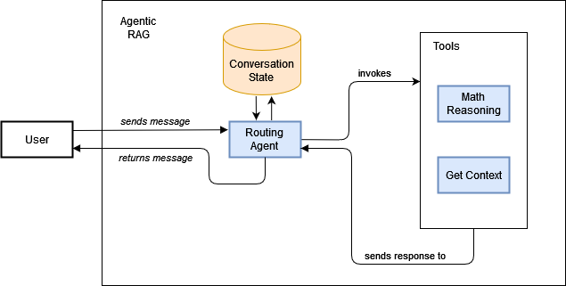
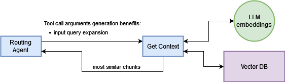
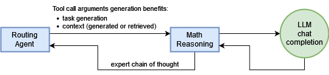

# Document OCR and RAG Question Answering

## Overview

In this project, we will build a system that can extract text from documents using OCR (Optical Character Recognition) and then use that text to answer questions using an agentic RAG workflow.

The system will consist of two main components:
1. Document Processing: This offline component is responsible for processing input document using OCR and storing the extracted text in a vector database.
2. Question Answering: This online component is responsible for answering questions based on the text stored in the vector database using an Agentic RAG workflow.

### Question Answering Workflow

#### Agentic RAG Workflow
Question Answering is performed using Azure OpenAI, which is a large language model (LLM) that can generate text and answer questions.
The designed system is displayed in figure below:



Agents included in the project are highlighted in light blue.

#### Routing Agent

The Routing Agent is responsible for:
1. getting conversation history from conversation state: ideally a nosql database such as MongoDB or AWS DynamoDB
2. invoking the LLM to understand what to do depending on current conversation:
   - if tools are needed, it will invoke the tool agent
   - if there are enought information, it will return an answer to the user
3. executing tool calls, i.e. deciding which tool to call and how to invoke it. 

Tool invocation has the benefit to split responsibilities and allow routing agent to make better decisions.
Moreover, it allows for beneficial query expansion. More details below.

### Get Context Agent
Get Context Agent is responsible for retrieving contextual information from the vector database (Qdrant).
Thanks to Routing Agent query expansion, the input to the retrieval is not just the user question, but an hypothetical query search which should increase similarity with embedded chunks.




#### Math Reasoning Agent
Math Reasoning Agent is responsible for performing math reasoning on the retrieved text.
This agent is invoked when the Routing Agent detects that the user question requires math reasoning.
By doing this, we can isolate which agent must be more capable of math reasoning, and choosing maybe a reasoning model capable of better performances.



### Document Processing
Document Processing is performed using Mistral OCR, which is a powerful OCR engine that can extract text from documents. 

The extracted text is then chunked using a simple iterative split based on markdown header levels. 
Since modern input context window are quite big, no check is made on sentence lenght.

Chunks are then embedded using Jina AI embeddings and stored in a vector database (Qdrant) for later retrieval.

## Tech Stack
The project is implemented using the following technologies:
- [Mistral OCR](https://mistral.ai/news/mistral-ocr), a powerful OCR engine for extracting text from documents.
- [Azure OpenAI](https://openai.azure.com/enterprise), a large language model (LLM) for generating text and answering questions.
- [Jina AI](https://jina.ai/), a cloud solution for sentence embedding
- [Qdrant](https://qdrant.tech/), a vector DB for storing and querying sentence embeddings
- [FastAPI](https://fastapi.tiangolo.com/), to serve the application via Websocket
- [Podman](https://podmain.io) a  [Docker](https://www.docker.com/)  open source equivalent, for containerization.

Tech stack may also include a document database such as MongoDB or AWS DynamoDB for storing conversation state and history.
For sake of simplicity, this project simply uses a in-memory dictionary in a single conversation.

### Environment Variables
To reproduce this code you have to set some environment variables (MistralAI, AzureOpenAI API Keys for llm completions, JinaAI API Keys for embeddings).

You can set the API key in your environment by creating a .env file similar `sample.env` file versioned.
Remember to not add to git your .env file with the API key.

## Executing the code in a container
This project can be run in a container using Docker or Podman.
To ease the reproducibility, Document Processing results are stored and versioned as file in `data/qdrant` folder.
TO use that file, set `QDRANT_PATH_TO_DB=data/qdrant` in your .env file.

To build the image from source you can than execute the following command:
```bash
podman build -t ocr-rag-qa .
```

Then you can run the container by running:
```bash
podman run --rm --env-file .env -p 8000:8000 ocr-rag-qa
```
Then you can access the application at [http://127.0.0.1:8000](http://127.0.0.1:8000)


## Executing the source code
This project uses `uv` so you can refer to `pyproject.toml` and `uv.lock` to replicate the environment.

### Executing the Document Processing source code
You can run script in `scripts/load_embeddings.py` with argument `--file_path YOUR_FILE`.

### Executing the Question Answering source code

Source code contains a `app.py` file that can be used to set up a http server using `uvicorn`.

To run the server, you can use the following command:
```bash
cd src && fastapi run app.py --port 8000
```

The server will be available at [localhost:8000](http://localhost:8000).

## Project Structure and details

The project is structured as follows:
```
./                                        # project root directory
│
├─ data                                   # Contains aux data files required by the applicaiton. 
│   ├─   .gitkeep                         # Versioned placeholder to track the empty folder
│   │
│   ├── processed                         # For better explanation, processed data have been versioned too
│   │   └───...                           
│   └── raw                               # For better explanation, raw data have been versioned too
│   │   └───...                           
│   │       
│   └── qdrant                            # For better explanation, qdrant data have been versioned too
│       └───...
│
├─ research                               # Contains experimental/research/draft scripts
│   ├─ .gitkeep
│   └── ...                                # These scripts are versioned as a journaling way but they must be excluded from final releases
│
├─ scripts                                # Reserved for utility scripts that aid in development (e.g. to create aux data) 
│   └─── load_embeddings.py                # Document Processing main script
│
├─ src
│   │
│   ├─── llm_handlers                      # Module containing all kind of LLM handlers
│   │   ├─── azure_openai_handler.py
│   │   ├─── base_handler.py
│   │   ├─── jina_handler.py
│   │   └─── mistral_handler.py
│   │
│   ├─── preprocessing                      # Utilities for document preprocessing
│   │   └─── chunking.py
│   │
│   ├─── prompts                            # Assumption: prompt is code, not configuration. Hence it is versioned.
│   │   ├─── routing_agent.py
│   │   └─── tool_agents.py
│   │
│   ├─── utils                              # General utilities for the Question Answering Agent Workflow
│   │   ├─── conversation_handler.py
│   │   ├─── dto.py
│   │   ├─── logger.py
│   │   ├─── ocr.py
│   │   └─── tool_client.py
│   │
│   └─── app.py                             # Main FastAPI entrypoint
│
├─ agent-rag-general.drawio.png             # Agent Diagram for README 
├─ Dockerfile                               # Dockerfile to create a deployable image
├─ pyproject.toml                           # Python project configuration file
├─ sample.env                               # Example of how to set up environment variables in .env
├─ too-get-context.drawio.png               # Tool Diagram for README
├─ tool-math-reasoning.drawio.png           # Tool Diagram for README
└─ uv.lock                                  # Python project lock file for reproducibility
```

The server provides a simple html page and a Websocket interface at `/ws` endpoint. The Websocket interface allows you to send messages to the server and receive responses in real-time. In this case it is used to send events such as tool calling start and end.

To do this, the main conversation handler `ConversationHandler.main` method has been implemented as an async function.

Routing Agent is developed in `ConversationHandler.routing_agent` method, which is iteratively called depending on the presence of a tool call request in last completion response.

Tool Agents are implemented in `ToolClient.get_context` and `ToolClient.math_reasoning` methods.

### Environment Variables
To reproduce this code you have to set some environment variables (MistralAI, AzureOpenAI API Keys for llm completions, JinaAI API Keys for embeddings).

You can set the API key in your environment by creating a .env file similar `sample.env` file versioned.
Remember to not add to git your .env file with the API key.

### Vector DB
You will need to set up a vector database to store the extracted text and embeddings. In this project, we will use Qdrant as our vector database. 
You can run Qdrant locally using Docker/Podman or not.

If you want to use simply a local file (SQLite under the hood), set env variable `QDRANT_PATH_TO_DB`.

If you want to run it in a Docker container:
1. set env variable QDRANT_URL and QDRANT_PORT
2. create a .qdrant_storage folder in project root
3. run the following command to start the client:
```bash
podman run -p 6333:6333 -p 6334:6334 -v ".\.qdrant_storage:/qdrant/storage/:z" qdrant
```
Web UI would then be available at [localhost:6333/dashboard](http://localhost:6333/dashboard)


